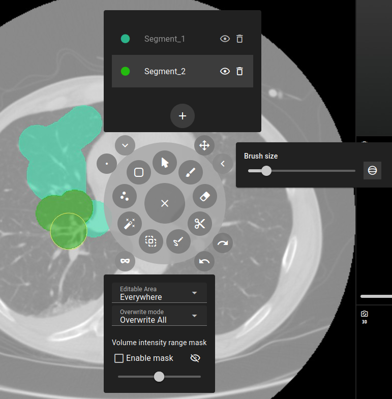
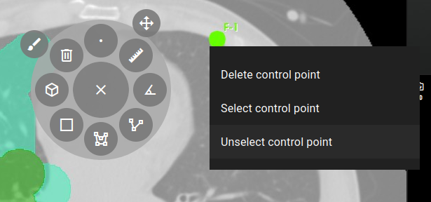

# Minimal

A quickstart example to see how it works

# Full

A full example with the possibility to try out all the features. It is meant to
be used as a documentation.

# Slicer example

```
pip install "trame-slicer[standalone]"
```

An example to show a nice use case of radial menus when being added to
[trame-slicer](https://github.com/KitwareMedical/trame-slicer)'s medical viewer
example.

The tool RadMenu shows the Markups and segmentation tools as well as their
options with the side menus.



A second RadMenu is used as a context menu that shows when right clicking on the
fiducial nodes of the views. It only consists of a RadMenu with no RadWheel, it
only has a right side menu.


